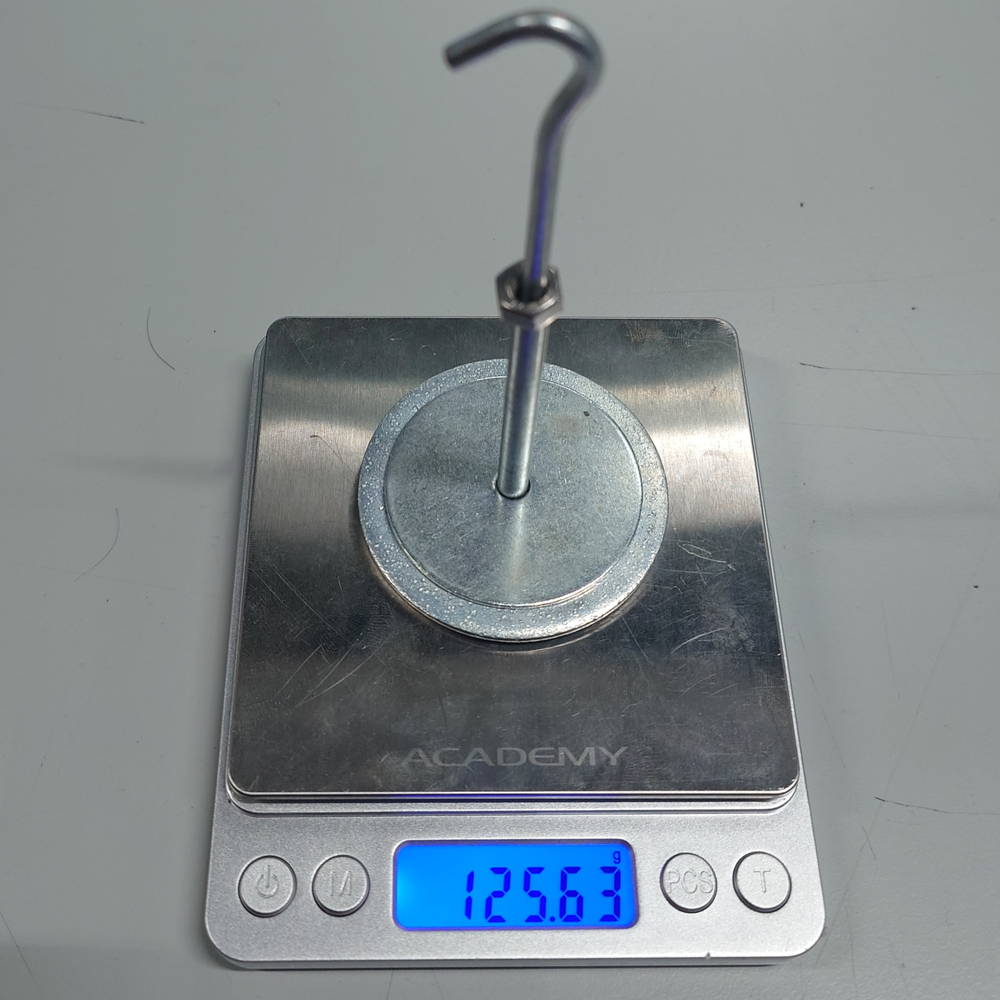

# PR4.2

__Requirement:__
> The manipulator shall lift a payload of up to 125 g.

__Success Criteria:__
> 125 g test mass lifted and held for ≥ 5 s.

__Method of Evaluation:__
> Attach calibrated 125 g test weight and command the manipulator to lift while timing duration.

## Evidence

A mass of 125.63 g was attatched to the gripper.

The manipulator was commanded to lift the mass from the fully extended position to the home position. The mass was held for over 5 s, timed using a stopwatch.

