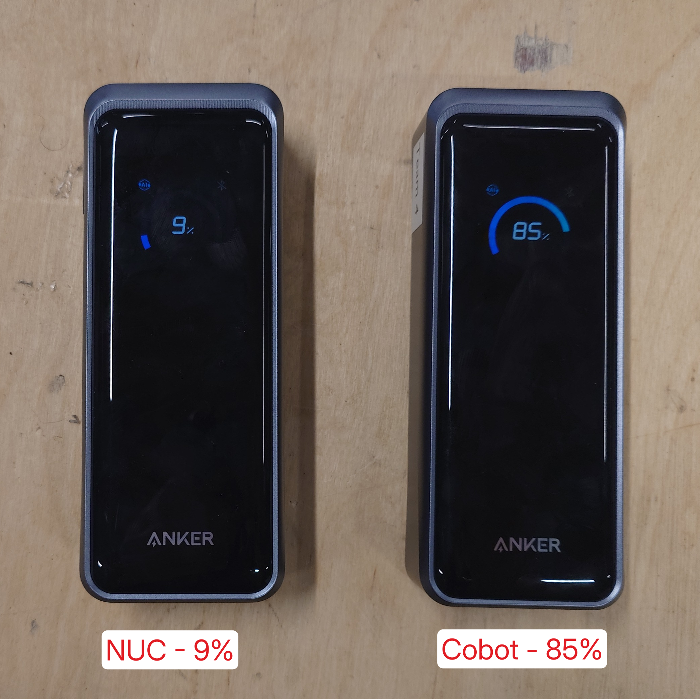

# FR8

__Requirement:__
> Power consumption shall allow full task duration.

__Success Criteria:__
> Runtime exceeds 20 minutes.

__Method of Evaluation:__
> Start timer and operate rover continuously until task duration reached or battery is empty.

## Evidence
At the start a lab session (16:00), the Intel NUC and myCobot 280 Pi were connected to fully-charged Anker Prime power banks, and the Rover to its battery.

The battery levels were recorded at the end of the lab serssion (17:58). The NUC battery had dropped to 9% and Cobot battery to 85%:

The system was able to operate for ~ 2 hours on battery, exceeding the required 20 minute runtime.